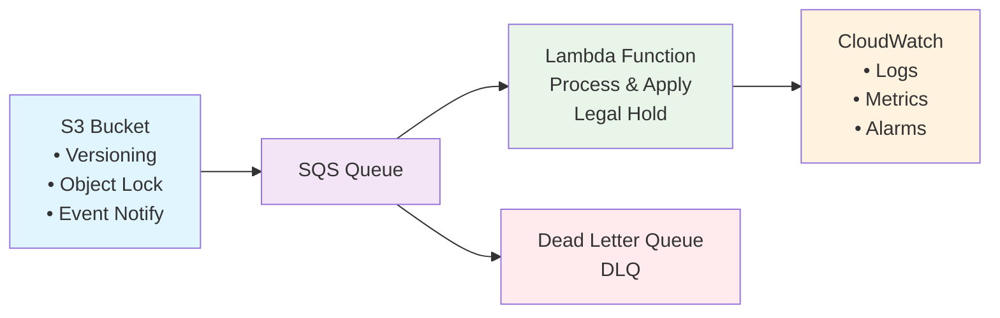
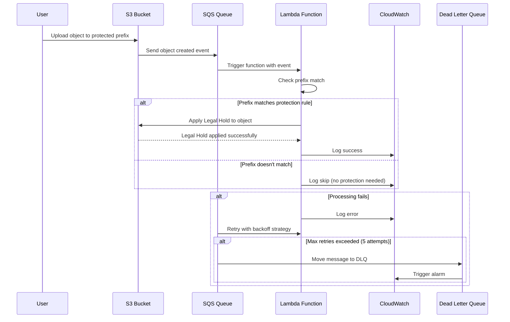
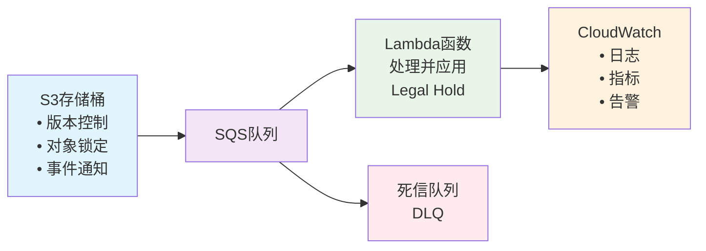
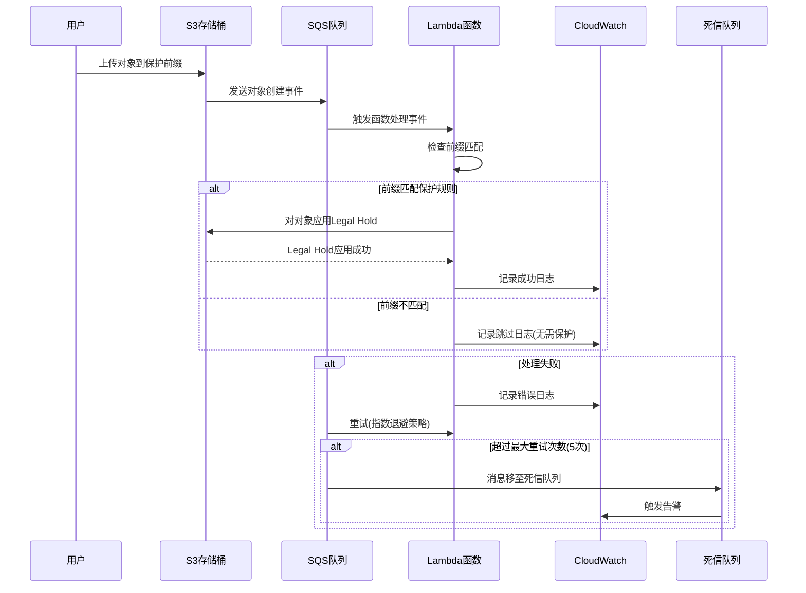

# S3 Prefix Protection System / S3前缀保护系统

[English](#english) | [中文](#中文)

---

## English

### Overview

The S3 Prefix Protection System is an automated AWS solution that applies Legal Hold protection to S3 objects based on configurable prefixes. When objects are uploaded to specified prefixes in your S3 bucket, the system automatically applies Legal Hold to prevent accidental deletion or modification.

### Architecture Diagram



### Process Flow



### Key Features

- **Automated Protection**: Automatically applies S3 Object Lock Legal Hold to objects matching specified prefixes
- **Event-Driven Architecture**: Uses S3 event notifications and SQS for reliable processing
- **Retry Mechanism**: Built-in retry logic with exponential backoff for robust operation
- **Monitoring & Alerting**: CloudWatch alarms for failed processing and dead letter queue monitoring
- **Easy Deployment**: Single-command deployment using CloudFormation
- **Configurable**: Customizable prefixes, Lambda settings, and lifecycle policies

### Architecture Components

- **S3 Bucket**: Source bucket with versioning and Object Lock enabled
- **Lambda Function**: Processes S3 events and applies Legal Hold protection
- **SQS Queue**: Reliable message processing with dead letter queue for failed messages
- **CloudWatch**: Monitoring, logging, and alerting
- **IAM Roles**: Least-privilege access for secure operations

### Prerequisites

- AWS CLI configured with appropriate permissions
- S3 bucket with versioning enabled (will be configured automatically if needed)
- Object Lock enabled on the bucket (will be configured automatically if needed)

### Quick Start

1. **Clone the repository**
   ```bash
   git clone <repository-url>
   cd s3-prefix-protection
   ```

2. **Deploy the system**
   ```bash
   ./deploy.sh my-protection-stack my-bucket-name "important/,backup/,archive/" us-east-1 60
   ```

   Parameters:
   - `stack-name`: CloudFormation stack name
   - `bucket-name`: Target S3 bucket name
   - `protected-prefixes`: Comma-separated list of prefixes to protect
   - `region`: AWS region
   - `lifecycle-days`: (Optional) Reference days for lifecycle policy (default: 60)

### Usage Examples

**Protect specific folders:**
```bash
./deploy.sh prod-protection my-prod-bucket "critical/,backups/,logs/" us-west-2
```

**Test the protection:**
```bash
# Upload a test file
echo "Test content" > test.txt
aws s3 cp test.txt s3://my-bucket/important/test.txt

# Check Legal Hold status
aws s3api get-object-legal-hold --bucket my-bucket --key important/test.txt
```

### Monitoring

**View processing logs:**
```bash
aws logs tail /aws/lambda/my-bucket-object-processor --follow
```

**Check for failed messages:**
```bash
aws sqs receive-message --queue-url <dead-letter-queue-url>
```

### Configuration

The system supports the following configuration options:

- **Protected Prefixes**: Define which object prefixes should be protected
- **Lambda Memory**: Adjust memory allocation (128MB - 3008MB)
- **Lambda Timeout**: Set processing timeout (1-900 seconds)
- **Lifecycle Days**: Configure lifecycle policy reference

### Security

- Uses least-privilege IAM roles
- Encrypted SQS queues
- CloudWatch logging for audit trails
- No hardcoded credentials

### Cost Analysis

#### Service Pricing Overview

**Amazon S3 Storage:**
- Standard storage: $0.023/GB for first 50TB/month
- Versioning impact: Each object version consumes additional storage
- Object Lock: No additional storage cost, but prevents deletion

**AWS Lambda:**
- Requests: $0.20 per 1M requests
- Compute: $0.0000133334 per GB-second (first 7.5B GB-seconds)
- Free tier: 1M requests and 400,000 GB-seconds per month

**Amazon SQS:**
- Standard queue: $0.40 per 1M requests (first 100B requests)
- Dead letter queue: Same pricing as standard queue
- Message retention: No additional cost for 14-day retention

**Amazon CloudWatch:**
- Logs ingestion: $0.50 per GB
- Logs storage: $0.03 per GB per month
- Custom metrics: $0.30 per metric per month
- Alarms: $0.10 per alarm per month

#### Cost Estimation Examples

*Note: All pricing estimates are based on US East (N. Virginia) region as of September 2025.*

**Small Scale (1,000 objects/month):**
- S3 storage (1GB): ~$0.02
- Lambda (1,000 invocations): ~$0.00 (within free tier)
- SQS (2,000 requests): ~$0.00 (within free tier)
- CloudWatch logs (10MB): ~$0.01
- **Total: ~$0.03/month**

**Medium Scale (100,000 objects/month):**
- S3 storage (100GB): ~$2.30
- Lambda (100,000 invocations): ~$0.02
- SQS (200,000 requests): ~$0.08
- CloudWatch logs (1GB): ~$0.53
- **Total: ~$2.93/month**

**Large Scale (1M objects/month):**
- S3 storage (1TB): ~$23.00
- Lambda (1M invocations): ~$0.20
- SQS (2M requests): ~$0.80
- CloudWatch logs (10GB): ~$5.30
- **Total: ~$29.30/month**

#### Cost Optimization Tips

**Lambda Optimization:**
- Use minimum required memory (128MB default)
- Optimize timeout settings to avoid unnecessary charges
- Batch processing can reduce invocation costs

**Storage Optimization:**
- Consider S3 Intelligent-Tiering for infrequently accessed objects
- Set appropriate lifecycle policies for old versions
- Monitor storage growth due to versioning

**Monitoring Optimization:**
- Adjust CloudWatch log retention period (default: 30 days)
- Use log filtering to reduce ingestion costs
- Set up billing alerts for cost monitoring

**Free Tier Benefits:**
- Lambda: 1M requests/month free for first 12 months
- CloudWatch: 10 custom metrics and 10 alarms free
- S3: 5GB storage free for first 12 months

#### Cost Monitoring

Set up AWS Budgets and Cost Explorer to monitor:
- Monthly spending by service
- Cost trends and projections
- Unusual usage patterns
- Budget alerts when costs exceed thresholds

### Cleanup

To remove the protection system:
```bash
aws cloudformation delete-stack --stack-name my-protection-stack --region us-east-1
```

---

## 中文

### 概述

S3前缀保护系统是一个自动化的AWS解决方案，基于可配置的前缀为S3对象应用Legal Hold保护。当对象上传到S3存储桶中的指定前缀时，系统会自动应用Legal Hold以防止意外删除或修改。

### 架构图



### 处理流程



### 核心功能

- **自动化保护**: 自动为匹配指定前缀的对象应用S3 Object Lock Legal Hold
- **事件驱动架构**: 使用S3事件通知和SQS进行可靠处理
- **重试机制**: 内置指数退避重试逻辑，确保操作稳定性
- **监控告警**: CloudWatch告警监控处理失败和死信队列
- **简易部署**: 使用CloudFormation单命令部署
- **可配置**: 可自定义前缀、Lambda设置和生命周期策略

### 架构组件

- **S3存储桶**: 启用版本控制和Object Lock的源存储桶
- **Lambda函数**: 处理S3事件并应用Legal Hold保护
- **SQS队列**: 可靠的消息处理，包含失败消息的死信队列
- **CloudWatch**: 监控、日志记录和告警
- **IAM角色**: 最小权限访问，确保安全操作

### 前置条件

- 配置了适当权限的AWS CLI
- 启用版本控制的S3存储桶（如需要会自动配置）
- 存储桶上启用Object Lock（如需要会自动配置）

### 快速开始

1. **克隆仓库**
   ```bash
   git clone <repository-url>
   cd s3-prefix-protection
   ```

2. **部署系统**
   ```bash
   ./deploy.sh my-protection-stack my-bucket-name "important/,backup/,archive/" us-east-1 60
   ```

   参数说明:
   - `stack-name`: CloudFormation堆栈名称
   - `bucket-name`: 目标S3存储桶名称
   - `protected-prefixes`: 要保护的前缀列表（逗号分隔）
   - `region`: AWS区域
   - `lifecycle-days`: （可选）生命周期策略参考天数（默认：60）

### 使用示例

**保护特定文件夹:**
```bash
./deploy.sh prod-protection my-prod-bucket "critical/,backups/,logs/" us-west-2
```

**测试保护功能:**
```bash
# 上传测试文件
echo "测试内容" > test.txt
aws s3 cp test.txt s3://my-bucket/important/test.txt

# 检查Legal Hold状态
aws s3api get-object-legal-hold --bucket my-bucket --key important/test.txt
```

### 监控

**查看处理日志:**
```bash
aws logs tail /aws/lambda/my-bucket-object-processor --follow
```

**检查失败消息:**
```bash
aws sqs receive-message --queue-url <dead-letter-queue-url>
```

### 配置选项

系统支持以下配置选项：

- **保护前缀**: 定义哪些对象前缀应该被保护
- **Lambda内存**: 调整内存分配（128MB - 3008MB）
- **Lambda超时**: 设置处理超时时间（1-900秒）
- **生命周期天数**: 配置生命周期策略参考

### 安全性

- 使用最小权限IAM角色
- 加密的SQS队列
- CloudWatch日志记录用于审计跟踪
- 无硬编码凭证

### 成本分析

#### 服务定价概览

**Amazon S3存储:**
- 标准存储: 前50TB每月$0.023/GB
- 版本控制影响: 每个对象版本都会消耗额外存储空间
- Object Lock: 无额外存储成本，但会阻止删除

**AWS Lambda:**
- 请求数: 每100万请求$0.20
- 计算时间: 每GB-秒$0.0000133334 (前75亿GB-秒)
- 免费套餐: 每月100万请求和40万GB-秒

**Amazon SQS:**
- 标准队列: 每100万请求$0.40 (前1000亿请求)
- 死信队列: 与标准队列相同定价
- 消息保留: 14天保留期无额外费用

**Amazon CloudWatch:**
- 日志摄取: 每GB $0.50
- 日志存储: 每月每GB $0.03
- 自定义指标: 每月每个指标$0.30
- 告警: 每月每个告警$0.10

#### 成本估算示例

*注：所有定价估算基于美国东部（弗吉尼亚北部）区域，截至2025年9月。*

**小规模使用 (1,000个对象/月):**
- S3存储 (1GB): ~$0.02
- Lambda (1,000次调用): ~$0.00 (免费套餐内)
- SQS (2,000个请求): ~$0.00 (免费套餐内)
- CloudWatch日志 (10MB): ~$0.01
- **总计: ~$0.03/月**

**中等规模使用 (100,000个对象/月):**
- S3存储 (100GB): ~$2.30
- Lambda (100,000次调用): ~$0.02
- SQS (200,000个请求): ~$0.08
- CloudWatch日志 (1GB): ~$0.53
- **总计: ~$2.93/月**

**大规模使用 (100万个对象/月):**
- S3存储 (1TB): ~$23.00
- Lambda (100万次调用): ~$0.20
- SQS (200万个请求): ~$0.80
- CloudWatch日志 (10GB): ~$5.30
- **总计: ~$29.30/月**

#### 成本优化建议

**Lambda优化:**
- 使用最小所需内存 (默认128MB)
- 优化超时设置以避免不必要的费用
- 批量处理可以减少调用成本

**存储优化:**
- 对不常访问的对象考虑使用S3智能分层
- 为旧版本设置适当的生命周期策略
- 监控由于版本控制导致的存储增长

**监控优化:**
- 调整CloudWatch日志保留期 (默认30天)
- 使用日志过滤来减少摄取成本
- 设置计费告警进行成本监控

**免费套餐优势:**
- Lambda: 前12个月每月100万请求免费
- CloudWatch: 10个自定义指标和10个告警免费
- S3: 前12个月5GB存储免费

#### 成本监控

设置AWS预算和成本浏览器来监控:
- 按服务的月度支出
- 成本趋势和预测
- 异常使用模式
- 超出阈值时的预算告警

### 清理

删除保护系统:
```bash
aws cloudformation delete-stack --stack-name my-protection-stack --region us-east-1
```

### 故障排除

**常见问题:**

1. **存储桶版本控制未启用**
   - 部署脚本会自动检测并提示启用

2. **Object Lock未启用**
   - 部署脚本会自动检测并提示启用

3. **权限不足**
   - 确保AWS CLI配置了足够的权限

4. **Lambda函数超时**
   - 调整Lambda超时设置或内存分配

**日志位置:**
- Lambda函数日志: `/aws/lambda/{bucket-name}-object-processor`
- S3通知配置日志: `/aws/lambda/{bucket-name}-s3-notification-config`
